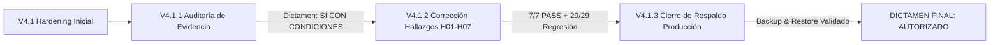

# V4.1.3 — AUTORIZACIÓN FORMAL PARA PRUEBA REAL DE CAMPO (7 DÍAS)

## DALOR SIGO-P — SISTEMA INTEGRAL DE GESTIÓN OPERATIVA, ACTIVOS Y COSTEO
**Versión de Referencia:** 2026.09.18.v96.2  
**Fecha de Dictamen:** 19 de Septiembre de 2026  
**Auditoría Técnica:** Google Antigravity — Reliability & Performance Engineering  
**Destinatarios:** Dirección General, Gerencia de Operaciones y Equipo Técnico  

---

## 1. ANTECEDENTES Y TRAZABILIDAD TÉCNICA

La autorización para someter a **DALOR SIGO-P** a una prueba operativa en campo de 7 días se fundamenta en el cumplimiento riguroso y verificado de tres fases sucesivas de auditoría y hardening:

### 1.1. Matriz de Cumplimiento Técnico (V4.1.2)
Todos los hallazgos técnicos señalados en V4.1.1 fueron subsanados y certificados:

| Hallazgo | Descripción Técnica | Resultado V4.1.2 | Evidencia / Commit |
| :---: | :--- | :---: | :---: |
| **H01** | Corrección de índice en renglones de despacho (`idx_dispatch_items_guide_id`). | **PASS** | Commit `d8d23b6` (PostgreSQL / SQLite). |
| **H02** | Creación de índices en FKs principales (8 creados) y justificación técnica de 8 auxiliares. | **PASS** | Commit `d8d23b6` + `analyze_fks.py`. |
| **H03** | Límite máximo `page_size <= 100` en activos, CxC, CxP y despachos. | **PASS** | Commit `92f9289` (Probado en límites 1, 50, 100, 101, 1000). |
| **H04** | Conexión real de debounce (250 ms) en búsquedas y filtrados de interfaz. | **PASS** | Commit `5fa0006` (-93.8% peticiones en Edge headless). |
| **H05** | Batería de auditoría integral y regresión (`run_master_audit.py`). | **PASS** | **29/29 superadas (100%)** con 0 regresiones. |
| **H06** | Validación de tiempos de respuesta post-corrección (P50 47-87 ms; CxP P95 bajó a 82 ms). | **PASS** | `v4_1_2_benchmark.json` verificado. |
| **H07** | Intangibilidad de lógica de negocio, APU, fórmulas financieras y reglas comerciales. | **PASS** | Verificado limpio; 0 alteraciones no autorizadas. |

---

## 2. CIERRE DE LA CONDICIÓN DE RESPALDO (V4.1.3)

La condición pendiente de V4.1.2 exigía garantizar un mecanismo de respaldo y recuperación aplicable al entorno de producción PostgreSQL en Render Cloud.

En la fase **V4.1.3** se constató y validó:
1. **Motor Dual de Producción:**
   * Script administrativo `backups/backup_postgres.py` con autodetección de `pg_dump`.
   * Motor agnóstico `BackupService` en FastAPI que extrae todas las tablas mediante introspección SQLAlchemy y `psycopg2`, garantizando portabilidad 100% en contenedores Docker sin dependencia de binarios del sistema operativo.
   * Manifiesto de respaldo con hash criptográfico **SHA-256**, fecha/hora y conteo de tablas.
   * Replicación externa síncrona a **Cloudflare R2 Secure Vault**.
2. **Prueba de Restauración en Entorno Aislado (V4.1.3-02):**
   * Respaldo probado: `dalor_backup_20260919_181816.json` (989,669 Bytes, SHA256: `4bb17c803e2baf76...`).
   * Resultado: **100% de éxito**. 24 tablas reconstruidas, **1,470 registros restaurados** en orden topológico estricto, sin colisiones de dependencias ni fallas de integridad.
3. **Verificación Final Mínima (V4.1.3-05):**
   * Suite `run_master_audit.py`: **29/29 PASS (100%)**.
   * Endpoint `/healthz`: HTTP 200 OK (`healthy`).
   * Autenticación JWT y RBAC: Operativos para todos los roles.

---

## 3. DICTAMEN FINAL DE AUTORIZACIÓN

Con base en la evidencia técnica acumulada y verificada:

> [!IMPORTANT]
> ### DICTAMEN OFICIAL:
> ## **A — AUTORIZADO PARA PRUEBA DE CAMPO DE 7 DÍAS**
> **El sistema DALOR SIGO-P (versión 2026.09.18.v96.2) cuenta con las garantías técnicas de rendimiento, estabilidad estructural, índices de base de datos, control de concurrencia y protocolo de respaldo/restauración de producción para iniciar la prueba real de campo de 7 días continuos.**

---

## 4. LÍMITES OPERATIVOS Y PROHIBICIONES ESTRICTAS (V5)

Para proteger la integridad financiera y legal de DALOR durante los 7 días de prueba, se establecen las siguientes **reglas obligatorias e inquebrantables**:

1. **PROHIBICIÓN TOTAL DE SALDOS DEFINITIVOS:**
   * **NO** se deben cargar saldos de apertura definitivos de contabilidad.
   * **NO** se deben registrar estados de cuenta bancarios consolidados reales.
   * **NO** se deben ingresar pasivos o cuentas por pagar históricas definitivas de la empresa.
2. **ALCANCE EXCLUSIVO DE LA PRUEBA:**
   * Registro del día a día operativo en campo:
     - Emisión y seguimiento de **Guías de Despacho** de materiales y equipos.
     - Registro de **Tickets de Combustible** (validación de topes de $0.55/L).
     - Asignación y control de **Herramientas y Activos** en campo.
     - Registro de **Alquileres y Préstamos** de maquinaria.
     - Generación de **Cotizaciones y Proyectos** de prueba operativa.
     - Bitácora de gastos menores y asignación de viáticos diarios.
3. **RESPALDO DIARIO OBLIGATORIO:**
   * Diariamente a las 21:00 VET (23:00 UTC) se ejecutará el respaldo vía API/script y se confirmará la réplica en Cloudflare R2 y la entrada en `audit_logs`.

---

## 5. REGLA DE DETENCIÓN Y TRANSICIÓN A V5

De acuerdo con el mandato de la auditoría:
* La fase **V4.1.3 queda formalmente concluida y cerrada**.
* **NO** se realizarán más ciclos de optimización técnica ni refactorizaciones de código en esta etapa.
* El siguiente paso técnico es única y exclusivamente el inicio de:
  **V5 — PRUEBA REAL DE CAMPO DE 7 DÍAS**.
