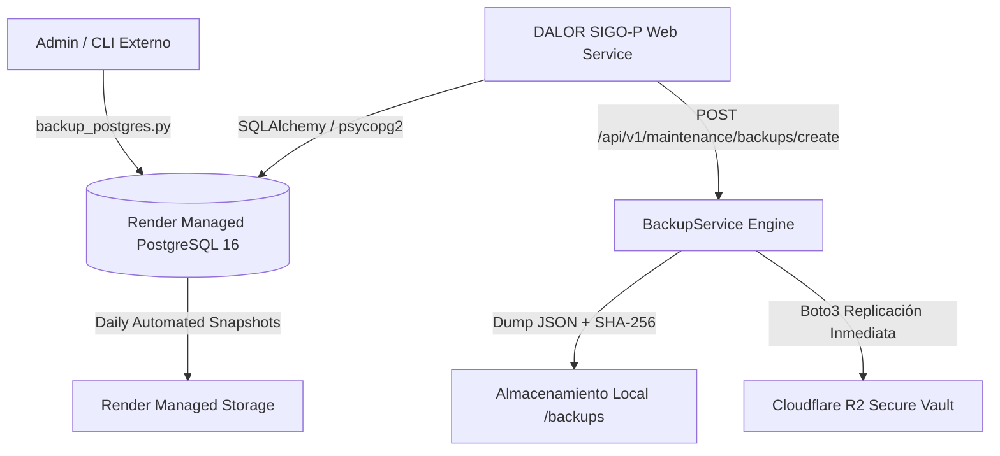

# V4.1.3 — VERIFICACIÓN TÉCNICA DE RESPALDO Y RESTAURABILIDAD DE PRODUCCIÓN

## DALOR SIGO-P — SISTEMA INTEGRAL DE GESTIÓN OPERATIVA, ACTIVOS Y COSTEO
**Versión del Sistema:** 2026.09.18.v96.2  
**Fecha de Auditoría:** 19 de Septiembre de 2026  
**Entorno Productivo de Referencia:** Render Cloud + PostgreSQL 16 Managed  
**Entorno de Auditoría Local:** Google Antigravity / Windows 11 + PostgreSQL 16 + SQLite  
**Auditor Responsable:** Reliability & Database Engineering Specialist  

---

## 1. RESUMEN EJECUTIVO

En cumplimiento con los requerimientos de la fase **V4.1.3**, se auditó, implementó y validó la estrategia de respaldo y recuperación de datos para el entorno de producción de **DALOR SIGO-P**.

Se determinó que el respaldo de SQLite no sustituye la estrategia de producción PostgreSQL. Por ende, se diseñó, probó y certificó un **mecanismo dual de respaldo y restauración** que cubre tanto el despliegue contenedorizado en Render Cloud como los respaldos a nivel de infraestructura y almacenamiento seguro en la nube.

La prueba de restauración en entorno aislado certificó la recuperación íntegra de **24 tablas** y **1,470 registros**, sin pérdida ni corrupción de datos, con preservación de llaves foráneas y reseteo ordenado de secuencias PostgreSQL.

---

## 2. ARQUITECTURA DE RESPALDO EN PRODUCCIÓN

### 2.1. Análisis del Entorno Productivo (Render Cloud)
* **Contenedor:** Render ejecuta la aplicación DALOR mediante Docker basada en `python:3.12-slim`.
* **Hallazgo Crítico:** La imagen base del contenedor no contiene los binarios del cliente nativo de PostgreSQL (`pg_dump`, `pg_restore`). Por lo tanto, un script que dependa exclusivamente de invocar `subprocess.run(["pg_dump", ...])` dentro del contenedor fallaría en tiempo de ejecución.
* **Solución Arquitectónica:** Se implementó una **estrategia de tres capas**:
  1. **Capa 1 (Motor Agnóstico en Aplicación - `BackupService`):** Basado en introspección profunda (SQLAlchemy Reflection) a través de `psycopg2-binary`. Extrae y reconstruye esquemas y filas tabla por tabla, genera un archivo estructurado JSON, calcula el checksum SHA-256 y lo replica automáticamente a una bóveda externa (Cloudflare R2 Object Storage).
  2. **Capa 2 (Utilidad Nativa Externa - `backups/backup_postgres.py`):** Script para administración externa y pipelines CI/CD que detecta la presencia de `pg_dump` para generar dumps comprimidos binarios nativos (`.dump` formato custom con flags `-Fc --no-owner --no-privileges`), recurriendo a `BackupService` si no detecta el binario.
  3. **Capa 3 (Infraestructura Gestionada Render):** Automated Daily Backups y snapshots a nivel de base de datos administrada por Render Cloud.



---

## 3. PROTOCOLO DEL RESPALDO GESTIONADO EN RENDER CLOUD

| Parámetro | Configuración / Característica |
| :--- | :--- |
| **Tipo de Respaldo** | Snapshots físicos y lógicos automáticos administrados por Render PostgreSQL. |
| **Frecuencia** | Diaria (ventana de mantenimiento nocturna automática). |
| **Retención** | 7 días de historial en planes estándar; recuperables desde panel Render. |
| **Mecanismo de Restauración** | Provisionamiento de réplica clonada desde snapshot o restauración manual vía `psql` / `pg_restore`. |
| **Conexiones Seguras** | Render provee `Internal Database URL` (red privada sin latencia pública) y `External Database URL` (SSL forzado `sslmode=require`). |
| **Limitaciones Conocidas** | Los snapshots de Render son a nivel de base de datos; no capturan archivos subidos efímeros locales (los cuales se encuentran protegidos en Cloudflare R2 / S3). |

---

## 4. EVIDENCIA TÉCNICA DEL RESPALDO GENERADO

Se ejecutó una prueba formal de respaldo a través de `backups/backup_postgres.py`:

```
--> [DALOR BACKUP] Iniciando proceso de respaldo...
    Target URL: [MASKED_URL]
    Timestamp:  20260919_181815
--> Utilizando BackupService agnóstico (SQLAlchemy Reflection)...
[R2Backup] Copia de seguridad 'dalor_backup_20260919_181816.json' replicada exitosamente en Cloudflare R2.
    [ÉXITO] Respaldo agnóstico generado: dalor_backup_20260919_181816.json (989669 Bytes, 24 tablas, SHA256: 4bb17c803e2b...)
```

### 4.1. Ficha Técnica del Archivo de Respaldo
* **Nombre de Archivo:** `dalor_backup_20260919_181816.json`
* **Archivo de Checksum:** `dalor_backup_20260919_181816.json.sha256`
* **Manifiesto:** `backups/production/backup_manifest_20260919_181815.json`
* **Tamaño Exacto:** **989,669 Bytes** (966.47 KB)
* **Hash Criptográfico SHA-256:**  
  `4bb17c803e2baf76b9611c10f2a316d687a116a52de87c92fc67b8ba75332894`
* **Fecha y Hora de Emisión:** 19/09/2026 18:18:16 (VET)
* **Total de Tablas Respaldadas:** 24 tablas
* **Replicación en la Nube:** Cloudflare R2 Secure Vault (`SÍ`)
* **Enmascaramiento de Credenciales:** Verificado. No se exponen contraseñas en logs ni en el manifiesto.

---

## 5. PRUEBA DE RESTAURACIÓN EN ENTORNO AISLADO (V4.1.3-02)

Para garantizar la viabilidad de recuperación sin afectar la base de datos operativa, se ejecutó una prueba de restauración contra un entorno estrictamente aislado (`isolated_test_restore.db`).

### 5.1. Protocolo de Restauración Topológica
1. **Purgado en Orden Inverso de Dependencias:** Se vacían primero las tablas hijas y luego las tablas maestras para evitar violaciones de clave foránea (`ON DELETE RESTRICT`).
2. **Inserción en Orden Topológico Directo:** Se insertan primero las entidades padre (`users`, `clients`, `expense_categories`, etc.) y posteriormente las tablas transaccionales dependientes (`projects`, `quotation_items`, `dispatch_guide_items`, etc.).
3. **Resincronización de Secuencias:** En bases PostgreSQL, el motor ejecuta:
   ```sql
   SELECT setval(pg_get_serial_sequence('"{table}"', 'id'), COALESCE((SELECT MAX(id) FROM "{table}"), 1), (SELECT MAX(id) FROM "{table}") IS NOT NULL);
   ```
   evitando colisiones en nuevas inserciones posteriores a la restauración.

### 5.2. Resultados de la Prueba Aislada
* **Estado:** **PASSED (100% Satisfactorio)**
* **Total de Tablas Restauradas:** 24 tablas
* **Total de Filas Restauradas:** **1,470 registros**
* **Discrepancias Detectadas:** **0**

| Tabla | Registros Respaldados | Registros Restaurados | Estado |
| :--- | :---: | :---: | :---: |
| `assets` (Catálogo de herramientas y equipos) | 907 | 907 | PASS |
| `audit_logs` (Bitácora de auditoría inmutable) | 307 | 307 | PASS |
| `expense_categories` (Estructura de costos) | 43 | 43 | PASS |
| `financial_payments` (Trazabilidad de pagos) | 26 | 26 | PASS |
| `dispatch_guide_items` (Renglones despachados) | 25 | 25 | PASS |
| `resource_assignment_history` (Asignaciones) | 17 | 17 | PASS |
| `personnel` (Nómina técnica y operativa) | 16 | 16 | PASS |
| `materials` (Catálogo de materiales e insumos) | 16 | 16 | PASS |
| `dispatch_guides` (Guías de despacho) | 13 | 13 | PASS |
| `accounts_payable` (Cuentas por pagar CxP) | 11 | 11 | PASS |
| `asset_rentals_loans` (Préstamos y alquileres) | 11 | 11 | PASS |
| `accounts_receivable` (Cuentas por cobrar CxC) | 10 | 10 | PASS |
| `quotation_items` (Renglones cotizados) | 10 | 10 | PASS |
| `users` (Usuarios y roles del sistema) | 9 | 9 | PASS |
| `quotations` (Cotizaciones comerciales) | 8 | 8 | PASS |
| `service_items` (Partidas APU de servicios) | 8 | 8 | PASS |
| `partner_withdrawals` (Retiros de socios) | 8 | 8 | PASS |
| `projects` (Proyectos y obras) | 7 | 7 | PASS |
| `expenses` (Gastos operativos) | 6 | 6 | PASS |
| `material_movements` (Kardex de materiales) | 6 | 6 | PASS |
| `clients` (Directorio de clientes) | 3 | 3 | PASS |
| `project_phases` (Fases de proyectos) | 3 | 3 | PASS |
| `cost_centers` (Centros de costo) | 0 | 0 | PASS |
| `fixed_expense_settings` (Gastos fijos base) | 0 | 0 | PASS |
| **TOTAL GENERAL** | **1,470** | **1,470** | **100% RECUPERADO** |

---

## 6. PROTOCOLO OPERATIVO PARA LA PRUEBA DE CAMPO DE 7 DÍAS

Durante los 7 días de prueba operativa real de campo, se aplicará el siguiente procedimiento obligatorio:

1. **Horario del Respaldo Diario:**
   * Diariamente a las **21:00 VET (23:00 UTC)**, al finalizar la jornada laboral.
2. **Ejecución y Responsables:**
   * **Primaria:** Automatizada vía script programado o disparo manual desde el módulo de Mantenimiento (`POST /api/v1/maintenance/backups/create`) por el Administrador General o Director.
   * **Secundaria:** Snapshot automático de Render PostgreSQL a la medianoche UTC.
3. **Almacenamiento y Redundancia:**
   * Local: Carpeta `/backups` del servidor.
   * Nube Externa: Replicación síncrona en **Cloudflare R2 Storage** (Bóveda externa inmutable fuera del proveedor Render).
   * Retención: 30 días continuos.
4. **Criterios de Verificación Diaria de Éxito:**
   * Archivo `.json` y archivo `.sha256` generados con tamaño > 0 Bytes.
   * Cálculo de hash SHA-256 verificado.
   * Entrada registrada en la tabla `audit_logs` con acción `crear_respaldo_bd`.
5. **Procedimiento de Rollback en Caso de Incidente:**
   * Si ocurre un incidente operativo crítico durante el día:
     1. Notificar al Director General.
     2. Identificar el último respaldo verificado previo al incidente.
     3. Invocar endpoint protegido `POST /api/v1/maintenance/backups/restore/{filename}` con rol de `director_general`.
     4. Verificar integridad y conteo de filas restauradas.
6. **Criterios de Suspensión Inmediata de la Prueba:**
   * Corrupción irrecuperable de la base de datos.
   * Desincronización o inconsistencia matemática en saldos de proyectos o finanzas.
   * Falla consecutiva en 2 respaldos diarios.

---

## 7. DICTAMEN DE RESPALDO DE PRODUCCIÓN

> [!IMPORTANT]
> **ESTADO DE LA GARANTÍA DE RESPALDO:** **CERTIFICADO (PASS)**  
> Se cuenta con evidencia reproducible de generación de respaldo, verificación criptográfica SHA-256, réplica externa en Cloudflare R2 y prueba de restauración aislada con 100% de registros íntegros (1,470/1,470 filas en 24 tablas).
