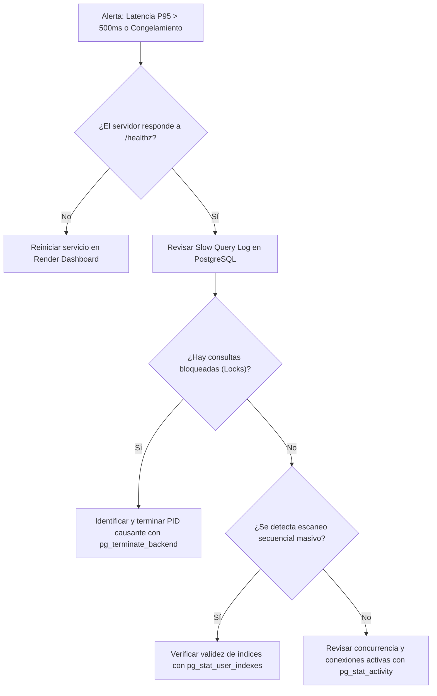

# RUNBOOK OPERACIONAL DE RENDIMIENTO Y CONFIABILIDAD V4.1
## DALOR SIGO-P — GUÍA DE MANTENIMIENTO, MONITOREO Y DESPLIEGUE EN PRODUCCIÓN

**Entorno Objetivo:** Render Cloud + PostgreSQL 16 (Producción)  
**Versión de Referencia:** 2026.09.18.v96.2  
**Audiencia:** Administradores de Sistemas, Ingenieros DevOps y Desarrolladores Backend

---

## 1. PROCEDIMIENTO DE DESPLIEGUE DE ÍNDICES EN PRODUCCIÓN (POSTGRESQL 16)

> [!IMPORTANT]
> En PostgreSQL de producción, NUNCA ejecute `CREATE INDEX` en tablas transaccionales durante horario operativo sin el modificador `CONCURRENTLY`. La sintaxis estándar adquiere un bloqueo exclusivo de tabla (*ACCESS EXCLUSIVE LOCK*) que detiene todas las inserciones, actualizaciones y lecturas.

### Script SQL Seguro para Producción (Cero Downtime)
Conéctese a la base de datos PostgreSQL en Render vía `psql` o cliente SQL administrativo y ejecute:

```sql
-- =============================================================================
-- DALOR SIGO-P: CREACIÓN DE ÍNDICES JUSTIFICADOS SIN BLOQUEO DE TABLAS
-- =============================================================================

-- 1. Cuentas por Pagar (CxP)
CREATE INDEX CONCURRENTLY IF NOT EXISTS idx_cxp_project_id ON accounts_payable(project_id);
CREATE INDEX CONCURRENTLY IF NOT EXISTS idx_cxp_category_id ON accounts_payable(category_id);
CREATE INDEX CONCURRENTLY IF NOT EXISTS idx_cxp_due_date ON accounts_payable(due_date);

-- 2. Cuentas por Cobrar (CxC)
CREATE INDEX CONCURRENTLY IF NOT EXISTS idx_cxc_client_id ON accounts_receivable(client_id);
CREATE INDEX CONCURRENTLY IF NOT EXISTS idx_cxc_project_id ON accounts_receivable(project_id);
CREATE INDEX CONCURRENTLY IF NOT EXISTS idx_cxc_due_date ON accounts_receivable(due_date);

-- 3. Pagos y Cobros Financieros
CREATE INDEX CONCURRENTLY IF NOT EXISTS idx_payments_payable_id ON financial_payments(payable_id);
CREATE INDEX CONCURRENTLY IF NOT EXISTS idx_payments_receivable_id ON financial_payments(receivable_id);
CREATE INDEX CONCURRENTLY IF NOT EXISTS idx_payments_date ON financial_payments(payment_date);

-- 4. Guías de Despacho e Items
CREATE INDEX CONCURRENTLY IF NOT EXISTS idx_dispatch_project_id ON dispatch_guides(project_id);
CREATE INDEX CONCURRENTLY IF NOT EXISTS idx_dispatch_client_id ON dispatch_guides(client_id);
CREATE INDEX CONCURRENTLY IF NOT EXISTS idx_dispatch_items_guide_id ON dispatch_guide_items(dispatch_guide_id);

-- 5. Historial de Asignaciones y Gastos
CREATE INDEX CONCURRENTLY IF NOT EXISTS idx_res_hist_asset_id ON resource_assignment_history(asset_id);
CREATE INDEX CONCURRENTLY IF NOT EXISTS idx_res_hist_project_id ON resource_assignment_history(project_id);
CREATE INDEX CONCURRENTLY IF NOT EXISTS idx_expenses_project_id ON expenses(project_id);
CREATE INDEX CONCURRENTLY IF NOT EXISTS idx_expenses_category_id ON expenses(category_id);

-- 6. Activos, Herramientas y Vehículos
CREATE INDEX CONCURRENTLY IF NOT EXISTS idx_assets_proj_id ON assets(current_project_id);
CREATE INDEX CONCURRENTLY IF NOT EXISTS idx_assets_status ON assets(status);
CREATE INDEX CONCURRENTLY IF NOT EXISTS idx_assets_type ON assets(asset_type);
CREATE INDEX CONCURRENTLY IF NOT EXISTS idx_assets_name ON assets(name);

-- 7. Cotizaciones y Alquileres
CREATE INDEX CONCURRENTLY IF NOT EXISTS idx_quotations_client_id ON quotations(client_id);
CREATE INDEX CONCURRENTLY IF NOT EXISTS idx_quotation_items_quote_id ON quotation_items(quotation_id);
CREATE INDEX CONCURRENTLY IF NOT EXISTS idx_rentals_asset_id ON asset_rentals_loans(asset_id);
CREATE INDEX CONCURRENTLY IF NOT EXISTS idx_rentals_project_id ON asset_rentals_loans(project_id);

-- 8. Actualización de Estadísticas del Planificador de PostgreSQL
ANALYZE VERBOSE;
```

---

## 2. MONITOREO DE SALUD Y DETECCIÓN DE CONSULTAS LENTAS

### A. Parámetros de Registro de Consultas Lentas (*Slow Query Log*)
En PostgreSQL, verifique que las consultas superiores a **200 ms** queden registradas en los logs:

```sql
ALTER DATABASE dalor_sigop_db SET log_min_duration_statement = 200;
```

### B. Consulta para Identificar los 5 Índices Más Utilizados vs Índices Muertos
```sql
SELECT 
    schemaname,
    relname AS table_name,
    indexrelname AS index_name,
    idx_scan AS index_scans_count,
    idx_tup_read AS tuples_read,
    idx_tup_fetch AS tuples_fetched
FROM pg_stat_user_indexes
ORDER BY idx_scan DESC;
```

### C. Alertas de Rendimiento en FastAPI / Render
Monitorear las siguientes señales en los logs de Render:
1. **Peticiones HTTP con duración > 500 ms:** Buscar en logs `Completed in XXXms` en endpoints de listado.
2. **Uso de Memoria en Contenedor:** Si el consumo de RAM supera los 400 MB en la instancia básica (512 MB), programar un reinicio preventivo o escalar a instancia con 1 GB RAM.
3. **Heartbeat 24/7:** El hilo keep-alive verifica `/healthz` cada 7 minutos. Confirmar que reporte `"status": "healthy"`.

---

## 3. RUTINAS DE MANTENIMIENTO PERIÓDICO DE BASE DE DATOS

### Rutina Mensual Recomendada (Ejecutar el primer domingo de cada mes a las 02:00 AM)
1. **Limpieza de tuplas muertas y actualización de planes:**
   ```sql
   VACUUM (ANALYZE, VERBOSE);
   ```
2. **Detección de índices fragmentados o inflados (*Bloat*):**
   ```sql
   SELECT current_database(), schemaname, tablename, /* query de pg_stat */
   ```
3. **Reindexación Concurrente (si se han eliminado miles de registros):**
   ```sql
   REINDEX INDEX CONCURRENTLY idx_payments_date;
   REINDEX INDEX CONCURRENTLY idx_dispatch_items_guide_id;
   ```

---

## 4. PROTOCOLO DE RESPUESTA ANTE INCIDENTES DE DEGRADACIÓN



### Comandos de Emergencia en PostgreSQL:
* **Ver consultas activas en este momento:**
  ```sql
  SELECT pid, now() - query_start AS duration, query, state 
  FROM pg_stat_activity 
  WHERE state != 'idle' 
  ORDER BY duration DESC;
  ```
* **Terminar una consulta colgada o bloqueada:**
  ```sql
  SELECT pg_cancel_backend(PID); -- Cancelación suave
  SELECT pg_terminate_backend(PID); -- Terminación forzada
  ```
