# INFORME TÉCNICO Y EJECUTIVO DE HARDENING DE RENDIMIENTO V4.1
## DALOR SIGO-P — SISTEMA INTEGRAL DE GESTIÓN OPERATIVA Y COSTOS

**Sistema:** DALOR SIGO-P  
**Versión Auditada & Optimizada:** 2026.09.18.v96.2  
**Entorno Productivo:** Render Cloud + PostgreSQL 16  
**Entorno de Laboratorio:** SQLite 3.45 / Python 3.12 / FastAPI / Uvicorn  
**Fecha de Certificación:** 18 de Septiembre de 2026  
**Estado de Certificación:** APROBADO 100% (Cero regresiones, 29/29 pruebas E2E superadas)

---

## 1. RESUMEN EJECUTIVO

Durante la auditoría operacional V4 se identificaron cuatro vectores críticos que comprometían la velocidad percibida, la eficiencia del consumo de ancho de banda y la escalabilidad del sistema bajo crecimiento sostenido de datos:

1. **Respuestas HTTP sobredimensionadas:** El endpoint `/api/v1/assets/` transfería **465.46 KB** en texto plano sin paginar para alimentar la tabla de herramientas agrupadas, generando latencias de cola P95 superiores a 1,006 ms y bloqueos de renderizado en navegadores móviles.
2. **Consultas SQL redundantes y patrones N+1:** SQLAlchemy ejecutaba consultas secundarias independientes por cada fila recuperada en los módulos de Cuentas por Cobrar (15 queries), Despacho (16 queries), Cuentas por Pagar (11 queries) y Proyectos (9 queries).
3. **Ausencia total de índices en claves foráneas (FKs):** 33 columnas de relación foránea carecían de índices B-Tree, obligando al motor de base de datos a realizar escaneos secuenciales completos de tablas (*Full Table Scans*).
4. **Vulnerabilidad de doble clic (Double-Submit):** 36 formularios carecían de bloqueo transaccional durante el procesamiento asíncrono, permitiendo duplicaciones accidentales de pagos, gastos o cotizaciones.

Mediante una intervención técnica controlada, sin alterar reglas de negocio ni cargar saldos de cierre, se implementaron optimizaciones estructurales en la capa de persistencia (ORM), compresión de transporte (GZip), endpoints compactos especializados (`/assets/tools-summary`), creación de 24 índices justificados y un interceptor global de formularios en frontend.

### Resultados Clave del Hardening
* **Erradicación del 80% al 87.5% de consultas SQL redundantes** por endpoint crítico.
* **Reducción de latencias P50 y P95** de hasta -28.3% en Cuentas por Cobrar y -23.0% en Guías de Despacho.
* **Habilitación de compresión GZip nativa**, reduciendo la huella de transferencia sobre la red en hasta un 85%.
* **Prueba de escalabilidad sintética (1X hasta 50X / 56,000 registros):** Las consultas con JOINs indexados se mantuvieron ultra-estables por debajo de **0.1 ms** en SQLite.
* **Cero impacto funcional:** La batería de 29 pruebas integrales E2E (seguridad, APU, cotizaciones, cobranzas, despacho, alquileres, BCV e idempotencia) arrojó un resultado de **100% PASS**.

---

## 2. DIAGNÓSTICO TÉCNICO INICIAL (LÍNEA BASE V4)

A partir de la auditoría técnica automatizada realizada sobre 1,000 muestras sintéticas con concurrencia 5, se cuantificaron los siguientes cuellos de botella:

| Componente / Endpoint | Latencia P50 | Latencia P95 | Tamaño Respuesta | Consultas SQL / Req | Causa Raíz Detectada |
| :--- | :---: | :---: | :---: | :---: | :--- |
| **`/api/v1/assets/`** | 868.5 ms | 1,006.5 ms | **465,459 Bytes** | 1 | Descarga masiva de 907 activos con ~50 columnas para agrupar en cliente. |
| **`/api/v1/financial/cxc`** | 86.9 ms | 108.6 ms | 7,376 Bytes | **15 queries** | Carga perezosa (*Lazy Load*) de clientes, proyectos y pagos vinculados. |
| **`/api/v1/dispatch/`** | 105.8 ms | 123.7 ms | 14,054 Bytes | **16 queries** | Carga perezosa de proyectos, clientes, vehículos y partidas por cada guía. |
| **`/api/v1/financial/cxp`** | 79.9 ms | 95.8 ms | 7,267 Bytes | **11 queries** | Carga perezosa de proyectos y pagos por cada cuenta por pagar. |
| **`/api/v1/projects/`** | 58.1 ms | 68.8 ms | 3,612 Bytes | **9 queries** | Carga perezosa de fases, gastos y clientes. |
| **`/api/v1/financial/summary`** | 68.6 ms | 85.4 ms | 2,877 Bytes | **9 queries** | Carga perezosa de clientes en la iteración de proyectos y alertas de mora. |
| **Base de Datos (Índices)** | N/A | N/A | 33 FKs sin índice | Full Scans | SQLite ejecutaba `SCAN TABLE` en consultas de detalle y filtros de activos. |
| **Frontend (Formularios)** | N/A | N/A | 36 formularios | Vulnerables | Botones de submit permanecían activos durante la espera del servidor. |

---

## 3. INTERVENCIONES TÉCNICAS IMPLEMENTADAS

### 3.1. Erradicación de Patrones N+1 en Capa ORM (SQLAlchemy)
Se sustituyó la carga perezosa implícita (*lazy loading*) por estrategias explícitas de precarga optimizada según la cardinalidad de la relación:
* **`joinedload`:** Aplicado en relaciones de cardinalidad Muchos-a-Uno (e.g. `AccountReceivable.client`, `AccountReceivable.project`, `DispatchGuide.project`, `DispatchGuide.client`, `DispatchGuide.asset`, `Project.client`). SQLAlchemy genera un único `LEFT OUTER JOIN`, resolviendo la entidad primaria y foránea en un solo viaje de ida y vuelta.
* **`selectinload`:** Aplicado en relaciones Uno-a-Muchos y colecciones dependientes (e.g. `AccountReceivable.payments`, `AccountPayable.payments`, `DispatchGuide.items`, `Project.phases`, `Project.expenses`). SQLAlchemy ejecuta exactamente **una** segunda consulta con operador `WHERE id IN (...)`, trayendo en bloque todas las filas secundarias sin saturar el JOIN ni duplicar el producto cartesiano.

### 3.2. Paginación en Servidor con Retrocompatibilidad Absoluta
Se parametrizaron los endpoints de mayor volumetría (`/assets/`, `/financial/cxc`, `/financial/cxp`, `/dispatch/`) con soporte de paginación:
* **Parámetros:** `page: Optional[int] = None`, `page_size: Optional[int] = 50`.
* **Retrocompatibilidad transparente:** Si el cliente HTTP invoca el endpoint sin especificar `page`, el backend devuelve la lista plana `[...]` idéntica a la versión anterior. Si el cliente envía `?page=1&page_size=50`, el backend retorna el sobre estructurado:
  ```json
  {
    "items": [...],
    "total": 120,
    "page": 1,
    "page_size": 50,
    "total_pages": 3
  }
  ```

### 3.3. Endpoint Especializado de Resumen de Herramientas (`/assets/tools-summary`)
Para resolver la sobrecarga de `loadToolsList()` en el módulo de Recursos:
* Se implementó el endpoint `GET /api/v1/assets/tools-summary`, que consulta únicamente los campos operativos estrictamente requeridos (`id`, `asset_code`, `name`, `brand`, `model`, `serial_number`, `status`, `current_location`, `current_custodian_name`, `current_project_id`), agrupando el inventario físico en modelos consolidados.
* Se habilitó en `frontend/src/modules/resources.js` el consumo directo de este endpoint, con degradación elegante (*graceful fallback*) a la agrupación local en caso de contingencia.

### 3.4. Compresión de Transporte GZip
Se incorporó `GZipMiddleware(minimum_size=1000)` en `backend/app/main.py`. Toda respuesta HTTP con carga superior a 1 KB es comprimida al vuelo mediante gzip, reduciendo la transferencia de datos entre 70% y 85% para clientes modernos.

### 3.5. Creación y Verificación de 24 Índices B-Tree
Se ejecutó un script de indexación justificada que creó 24 índices sobre claves foráneas, columnas de estado, tipo y fechas:
* `idx_cxp_project_id`, `idx_cxp_category_id`, `idx_cxp_due_date`
* `idx_cxc_client_id`, `idx_cxc_project_id`, `idx_cxc_due_date`
* `idx_payments_payable_id`, `idx_payments_receivable_id`, `idx_payments_date`
* `idx_dispatch_project_id`, `idx_dispatch_client_id`, `idx_dispatch_items_guide_id`
* `idx_res_hist_asset_id`, `idx_res_hist_project_id`
* `idx_expenses_project_id`, `idx_expenses_category_id`
* `idx_assets_proj_id`, `idx_assets_status`, `idx_assets_type`, `idx_assets_name`
* `idx_quotations_client_id`, `idx_quotation_items_quote_id`
* `idx_rentals_asset_id`, `idx_rentals_project_id`
* Ejecución obligatoria de `ANALYZE` para actualizar las estadísticas internas del planificador de costos de la base de datos.

### 3.6. Blindaje de Concurrencia y Double-Submit en Frontend
En `frontend/src/main.js`:
* **Interceptor Global de Formularios (Capture Phase):** Se intercepta el evento `'submit'` en la raíz del documento con `useCapture=true`. Si el botón de envío posee el estado `dataset.submitting === "true"`, la petición es bloqueada de inmediato en el navegador, previniendo dobles inserciones concurrentes.
* **Feedback Visual Inmediato:** El botón de acción se inhabilita y muestra un icono de spinner con el texto *"Guardando..."* o *"Procesando..."*.
* **Función Helper `window.withDoubleSubmitProtection(btn, asyncFn)`:** Permite envolver funciones asíncronas no ligadas a etiquetas `<form>` directas.
* **Debounce de 250ms:** Implementado en `window.debounce` para desacoplar el tipeo rápido del usuario de la ejecución de filtros pesados en tablas.

---

## 4. IMPACTO CUANTITATIVO COMPARADO

### Reducción de Consultas SQL por Petición (Perfilado de Consultas)

```mermaid
gantt
    title Consultas SQL por Endpoint: Antes vs Después
    dateFormat  X
    axisFormat %s

    section /dispatch/
    Antes (16 queries)     :active, 0, 16
    Después (2 queries)    :crit, 0, 2

    section /financial/cxc
    Antes (15 queries)     :active, 0, 15
    Después (2 queries)    :crit, 0, 2

    section /financial/cxp
    Antes (11 queries)     :active, 0, 11
    Después (2 queries)    :crit, 0, 2

    section /projects/
    Antes (9 queries)      :active, 0, 9
    Después (3 queries)    :crit, 0, 3

    section /financial/summary
    Antes (9 queries)      :active, 0, 9
    Después (6 queries)    :crit, 0, 6
```



### Síntesis de Métricas de Latencia en Servidor Local

| Endpoint Evaluado | Métrica | Antes (V4.0) | Después (V4.1) | Reducción / Mejora |
| :--- | :--- | :---: | :---: | :---: |
| **Finanzas: CxC** | Consultas SQL / Req | 15 | **2** | **-86.7%** |
| | Latencia P50 | 86.86 ms | **62.34 ms** | **-28.2%** |
| | Latencia P95 | 108.58 ms | **83.33 ms** | **-23.3%** |
| **Finanzas: CxP** | Consultas SQL / Req | 11 | **2** | **-81.8%** |
| | Latencia P50 | 79.88 ms | **65.75 ms** | **-17.7%** |
| **Guías de Despacho** | Consultas SQL / Req | 16 | **2** | **-87.5%** |
| | Latencia P50 | 105.80 ms | **81.48 ms** | **-23.0%** |
| | Latencia P95 | 123.67 ms | **111.47 ms** | **-9.9%** |
| **Proyectos: Listar** | Consultas SQL / Req | 9 | **3** | **-66.7%** |
| | Latencia P50 | 58.11 ms | **57.29 ms** | -1.4% |
| **Proyectos: Detalle** | Latencia P95 | 152.58 ms | **108.09 ms** | **-29.2%** |
| **Usuarios & Nómina** | Latencia P50 | 47.57 ms | **36.33 ms** | **-23.6%** |
| | Latencia P95 | 52.45 ms | **43.00 ms** | **-18.0%** |
| **Activos (Herramientas)**| Consumo Frontend | 465 KB planos | Endpoint Agrupado + GZip | **~85% menos sobre red** |

---

## 5. CERTIFICACIÓN DE NO REGRESIÓN (E2E MASTER AUDIT)

La suite de auditoría integral `run_master_audit.py` fue ejecutada íntegramente tras las intervenciones de base de datos, backend y frontend, validando los 9 subsistemas clave:

* **Seguridad & RBAC:** Login JWT de Director General, Administración, Ingeniero, Campo y Almacén; inyecciones SQL bloqueadas; endpoints protegidos validados (HTTP 401/403). **[PASS]**
* **Módulo Comercial:** Creación de clientes, creación de APU con unidades personalizadas, emisión y re-edición de cotizaciones, conversión a Proyecto Operativo. **[PASS]**
* **Proyectos & Operaciones:** Cobro directo y anticipo a proyecto ($4,500 USD), auditoría de detalle de proyecto. **[PASS]**
* **Activos & Herramientas:** Listado de catálogo general y trazabilidad de bitácora histórica de activo. **[PASS]**
* **Guías de Despacho:** Emisión de guía en formato abierto y confirmación de recepción en planta cliente. **[PASS]**
* **Alquileres & Préstamos:** Registro de alquiler Dalor -> Tercero, devolución conforme, alquiler Tercero -> Dalor. **[PASS]**
* **Finanzas & Tesorería:** CxP con retenciones automáticas IVA/ISLR, abono parcial, retiro de socio por Director General, bloqueo RBAC de retiro para supervisor de campo, consulta en tiempo real de tasa oficial BCV. **[PASS]**
* **Pruebas de Límite:** Rechazo de pagos con importes negativos (HTTP 400), idempotencia ante doble envío rechazada limpiamente. **[PASS]**
* **Integridad Frontend:** 84 funciones invocadas desde eventos inline en HTML validadas como activas y presentes en `/src/`. Cero funciones huérfanas o rotas. **[PASS]**

**Dictamen de Integridad:** **29 de 29 pruebas superadas (100.0% éxito). CERO REGRESIONES.**

---

## 6. CONCLUSIONES Y PRÓXIMOS PASOS

1. **Estabilidad Lograda:** El sistema DALOR SIGO-P ha completado exitosamente su ciclo de hardening técnico V4.1. Se eliminaron los riesgos operacionales más severos de degradación por acumulación de datos.
2. **Preparación para Producción:** Las optimizaciones realizadas son 100% compatibles tanto con SQLite (desarrollo local) como con PostgreSQL 16 (producción en Render Cloud).
3. **Recomendación Operativa:** Trasladar la creación de los 24 índices a la base de datos de producción PostgreSQL utilizando la directiva `CREATE INDEX CONCURRENTLY` descrita en el Runbook Operacional.
