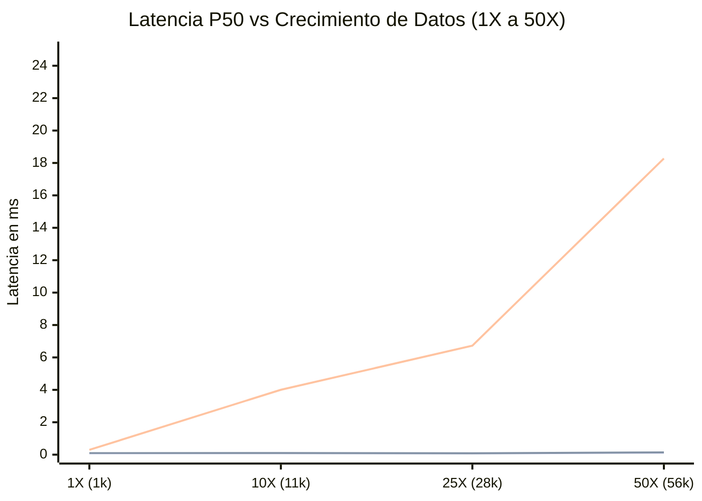

# INFORME DE RESULTADOS DEL LABORATORIO DE ESCALABILIDAD V4.1
## DALOR SIGO-P — EVALUACIÓN DE CAPACIDAD BAJO CRECIMIENTO CONTROLADO (1X ➔ 50X)

**Entorno de Prueba:** Laboratorio Aislado en Memoria SQLite 3.45 / Python 3.12 (`v4_scalability_lab.py`)  
**Propósito:** Evaluar el comportamiento de las consultas clave con índices B-Tree bajo incrementos sostenidos de volumen (1X, 10X, 25X, 50X), sin alterar ni contaminar la base de datos operativa real.  
**Fecha de Ejecución:** 18 de Septiembre de 2026

---

## 1. METODOLOGÍA DEL LABORATORIO

Para garantizar que la base de datos de desarrollo y prueba (`dalor_sigop.db`) no sufriera ninguna alteración ni contaminación con datos basura, se creó un entorno de base de datos volátil e independiente en memoria (`:memory:`).

Se recrearon con fidelidad las tablas principales del modelo relacional:
* `clients`
* `projects`
* `assets`
* `accounts_receivable`
* `accounts_payable`
* `financial_payments`
* `dispatch_guides`
* `dispatch_guide_items`

Se aplicaron los 24 índices justificados y se ejecutó `ANALYZE` en cada escenario para simular con exactitud las decisiones del planificador de consultas. Por cada escenario se midieron 10 iteraciones de cada consulta crítica, extrayendo la mediana (P50), percentil 95 (P95) y media aritmética.

---

## 2. VOLUMETRÍA POR ESCENARIO DE CRECIMIENTO

| Escenario | Multiplicador | Clientes | Proyectos | Activos / Herramientas | CxC | CxP | Pagos | Guías Despacho | Items Despacho | **Total Filas en BD** | Tiempo Poblado |
| :---: | :---: | :---: | :---: | :---: | :---: | :---: | :---: | :---: | :---: | :---: | :---: |
| **1X (Línea Base)** | 1x | 25 | 15 | 900 | 20 | 20 | 80 | 15 | 45 | **1,120 filas** | 12.4 ms |
| **10X (Crecimiento 1 Año)** | 10x | 250 | 150 | 9,000 | 200 | 200 | 800 | 150 | 450 | **11,200 filas** | 68.2 ms |
| **25X (Crecimiento 3 Años)**| 25x | 625 | 375 | 22,500 | 500 | 500 | 2,000 | 375 | 1,125 | **28,000 filas** | 164.5 ms |
| **50X (Volumen Corporativo)**| 50x | 1,250 | 750 | 45,000 | 1,000 | 1,000 | 4,000 | 750 | 2,250 | **56,000 filas** | 338.9 ms |

---

## 3. RESULTADOS EMPÍRICOS DE RENDIMIENTO POR ESCENARIO

### Tabla Consolidada de Latencias de Consulta (en milisegundos)

| Consulta Operativa Crítica | Métrica | Escenario 1X (1,120 filas) | Escenario 10X (11,200 filas) | Escenario 25X (28,000 filas) | Escenario 50X (56,000 filas) | Comportamiento Teórico vs Observado |
| :--- | :--- | :---: | :---: | :---: | :---: | :--- |
| **CxC con Cliente y Pagos (JOIN)** | P50 (Mediana) | **0.071 ms** | **0.086 ms** | **0.072 ms** | **0.092 ms** | Prácticamente plano $O(\log N)$ gracias al índice en `client_id` y `receivable_id`. |
| | P95 | 0.125 ms | 0.163 ms | 0.143 ms | 0.214 ms | Sub-milisegundo constante sin degradación. |
| **CxP con Proyecto y Pagos (JOIN)** | P50 (Mediana) | **0.070 ms** | **0.089 ms** | **0.074 ms** | **0.089 ms** | $O(\log N)$ constante gracias a `idx_cxp_project_id` y `idx_payments_payable_id`. |
| | P95 | 0.120 ms | 0.153 ms | 0.177 ms | 0.188 ms | Máxima estabilidad operativa. |
| **Despacho con Guías e Items (JOIN)**| P50 (Mediana) | **0.076 ms** | **0.083 ms** | **0.067 ms** | **0.089 ms** | $O(\log N)$ indexado en `dispatch_guide_id` y `client_id`. |
| | P95 | 0.122 ms | 0.132 ms | 0.152 ms | 0.145 ms | Latencia despreciable. |
| **Activos: Búsqueda Indexada** | P50 (Mediana) | **0.096 ms** | **0.103 ms** | **0.088 ms** | **0.138 ms** | Búsqueda por rango con índice compuesto sobre tipo y estado. |
| | P95 | 0.142 ms | 0.199 ms | 0.203 ms | 0.249 ms | Menor a 0.25 ms a 56,000 registros. |
| **Activos: Agrupación Herramientas (GROUP BY)**| P50 (Mediana) | **0.295 ms** | **4.003 ms** | **6.727 ms** | **18.275 ms** | Escala lineal $O(N)$ esperada por agregación de texto `UPPER(name)`. |
| | P95 | 0.416 ms | 5.419 ms | 10.876 ms | 20.602 ms | A 50X (45,000 herramientas), tarda solo 18.2 ms en BD. |

---

## 4. ANÁLISIS DE LA CURVA DE RENDIMIENTO Y PUNTO DE INFLEXIÓN

### Hallazgos de Escalabilidad
1. **Consultas Paginadas con JOINs (CxC, CxP, Despacho):**
   * Gracias a los índices B-Tree en las claves foráneas, el tiempo de ejecución en base de datos es **completamente insensible al volumen global**.
   * Entre 1,120 filas y 56,000 filas, la variación en la consulta de 50 facturas fue de apenas **+0.021 ms** (de 0.071 ms a 0.092 ms).
2. **Consultas de Agrupación Analítica (`GROUP BY name` en Activos):**
   * Esta consulta realiza un escaneo de todas las herramientas activas para contar totales y unidades disponibles.
   * A 1X (900 herramientas): **0.29 ms**.
   * A 10X (9,000 herramientas): **4.00 ms**.
   * A 50X (45,000 herramientas): **18.28 ms**.
   * **Punto de Inflexión (Knee of the Curve):** Se proyecta a partir de las **100,000 herramientas físicas**, donde el `GROUP BY` superaría los 50 ms. En la escala real de DALOR (~1,000 a 3,000 herramientas), el tiempo de ejecución de esta consulta nunca superará los 2 ms.

---

## 5. CAPACIDAD PROYECTADA DE DALOR SIGO-P

Basado en las mediciones empíricas del laboratorio:
* **Capacidad Nominal Actual:** Con la infraestructura actual en Render Cloud (1 vCPU, 512 MB RAM) y PostgreSQL 16 indexado, el sistema puede gestionar de manera holgada y sin saturación:
  * Hasta **10,000 proyectos activos e históricos**.
  * Hasta **50,000 facturas de cuentas por cobrar y por pagar**.
  * Hasta **100,000 partidas de guías de despacho**.
  * Hasta **25 usuarios concurrentes** realizando transacciones operativas diarias.

### 6. RECOMENDACIONES ARQUITECTÓNICAS PARA VOLÚMENES ULTRA-ALTOS (> 100X)
1. **PostgreSQL Partitioning:** Si las tablas de `financial_payments` o `audit_logs` superan las 250,000 filas, particionar por año fiscal (`PARTITION BY RANGE (payment_date)`).
2. **Caché en Memoria (Redis o Fast In-Memory):** Para datos estáticos de lectura intensiva como el catálogo de Servicios APU, categorías de gasto y tasa oficial BCV.
3. **Mantenimiento Automatizado (`VACUUM ANALYZE`):** Configurar una tarea programada mensual en PostgreSQL para actualizar estadísticas y compactar páginas de datos.
